# Deep-Learning-challenge
DAV Module 21 Deep Learning Challenge

*👇👇👇Results Overview at the end👇👇👇*

# Unit 21 Homework: Charity Funding Predictor

## Background

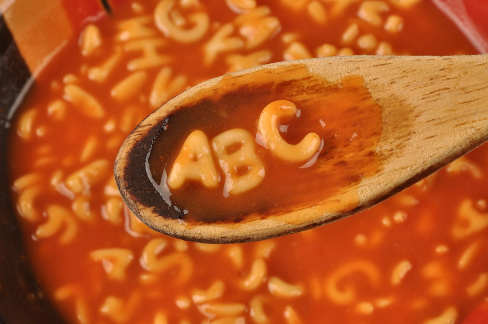

The nonprofit foundation Alphabet Soup wants a tool that can help it select the applicants for funding with the best chance of success in their ventures. With your knowledge of machine learning and neural networks, you’ll use the features in the provided dataset to create a binary classifier that can predict whether applicants will be successful if funded by Alphabet Soup.

From Alphabet Soup’s business team, you have received a CSV containing more than 34,000 organizations that have received funding from Alphabet Soup over the years. Within this dataset are a number of columns that capture metadata about each organization, such as:

* **EIN** and **NAME**—Identification columns
* **APPLICATION_TYPE**—Alphabet Soup application type
* **AFFILIATION**—Affiliated sector of industry
* **CLASSIFICATION**—Government organization classification
* **USE_CASE**—Use case for funding
* **ORGANIZATION**—Organization type
* **STATUS**—Active status
* **INCOME_AMT**—Income classification
* **SPECIAL_CONSIDERATIONS**—Special consideration for application
* **ASK_AMT**—Funding amount requested
* **IS_SUCCESSFUL**—Was the money used effectively

## Instructions

### Step 1: Preprocess the Data

Using your knowledge of Pandas and scikit-learn’s `StandardScaler()`, you’ll need to preprocess the dataset. This step prepares you for Step 2, where you'll compile, train, and evaluate the neural network model.

Using the information we have provided in the starter code, follow the instructions to complete the preprocessing steps.

1. Read in the charity_data.csv to a Pandas DataFrame, and be sure to identify the following in your dataset:
  * What variable(s) are the target(s) for your model?
  * What variable(s) are the feature(s) for your model?

2. Drop the `EIN` and `NAME` columns.

3. Determine the number of unique values for each column.

4. For columns that have more than 10 unique values, determine the number of data points for each unique value.

5. Use the number of data points for each unique value to pick a cutoff point to bin "rare" categorical variables together in a new value, `Other`, and then check if the binning was successful.

6. Use `pd.get_dummies()` to encode categorical variables.

### Step 2: Compile, Train, and Evaluate the Model

Using your knowledge of TensorFlow, you’ll design a neural network, or deep learning model, to create a binary classification model that can predict if an Alphabet Soup–funded organization will be successful based on the features in the dataset. You’ll need to think about how many inputs there are before determining the number of neurons and layers in your model. Once you’ve completed that step, you’ll compile, train, and evaluate your binary classification model to calculate the model’s loss and accuracy.

1. Continue using the Jupyter Notebook in which you performed the preprocessing steps from Step 1.

2. Create a neural network model by assigning the number of input features and nodes for each layer using TensorFlow and Keras.

3. Create the first hidden layer and choose an appropriate activation function.

4. If necessary, add a second hidden layer with an appropriate activation function.

5. Create an output layer with an appropriate activation function.

6. Check the structure of the model.

7. Compile and train the model.

8. Create a callback that saves the model's weights every five epochs.

9. Evaluate the model using the test data to determine the loss and accuracy.

10. Save and export your results to an HDF5 file. Name the file `AlphabetSoupCharity.h5`.

### Step 3: Optimize the Model

Using your knowledge of TensorFlow, optimize your model to achieve a target predictive accuracy higher than 75%.

Using any or all of the following methods to optimize your model:

* Adjust the input data to ensure that no variables or outliers are causing confusion in the model, such as:
  * Dropping more or fewer columns.
  * Creating more bins for rare occurrences in columns.
  * Increasing or decreasing the number of values for each bin.
* Add more neurons to a hidden layer.
* Add more hidden layers.
* Use different activation functions for the hidden layers.
* Add or reduce the number of epochs to the training regimen.

**Note**: If you make at least three attempts at optimizing your model, you will not lose points if your model does not achieve target performance.

1. Create a new Jupyter Notebook file and name it `AlphabetSoupCharity_Optimzation.ipynb`.

2. Import your dependencies and read in the `charity_data.csv` to a Pandas DataFrame.

3. Preprocess the dataset like you did in Step 1, Be sure to adjust for any modifications that came out of optimizing the model.

4. Design a neural network model, and be sure to adjust for modifications that will optimize the model to achieve higher than 75% accuracy.

5. Save and export your results to an HDF5 file. Name the file `AlphabetSoupCharity_Optimization.h5`.

# Step 4: Write a Report on the Neural Network Model

For this part of the assignment, you’ll write a report on the performance of the deep learning model you created for AlphabetSoup.

The report should contain the following:

1. **Overview** of the analysis: Explain the purpose of this analysis.

*The Alphabet Soup foundation, a non-profit organization, is seeking a tool that can assist in identifying the most promising applicants for funding.*

*The aim of this tool is to use machine learning and neural networks to evaluate the features in the given dataset and develop a binary classifier that can forecast the success potential of applicants if they receive funding from Alphabet Soup foundation.*

2. **Results**: Using bulleted lists and images to support your answers, address the following questions.

## Data Preprocessing
  * What variable(s) are the target(s) for your model?

    *The target variable for the model is represented by the `IS_SUCCESSFUL` column, which contains binary values of either 0 or 1.*

  * What variable(s) are the features for your model?

    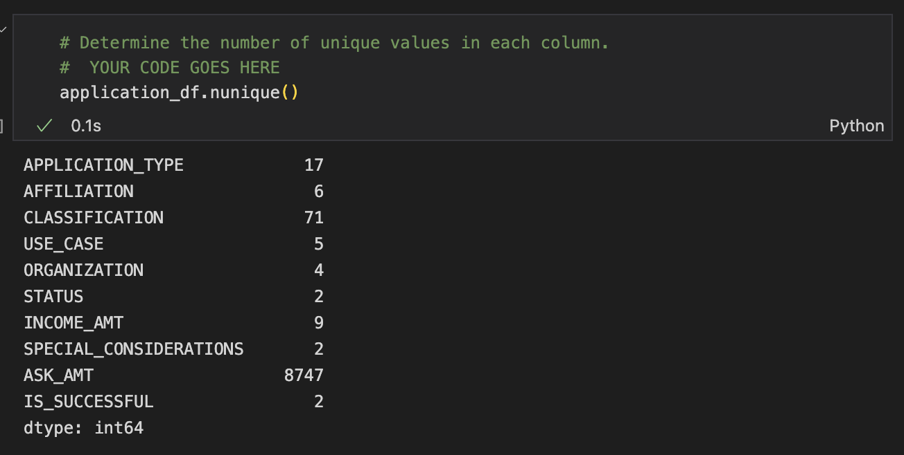

  * What variable(s) should be removed from the input data because they are neither targets nor features?

    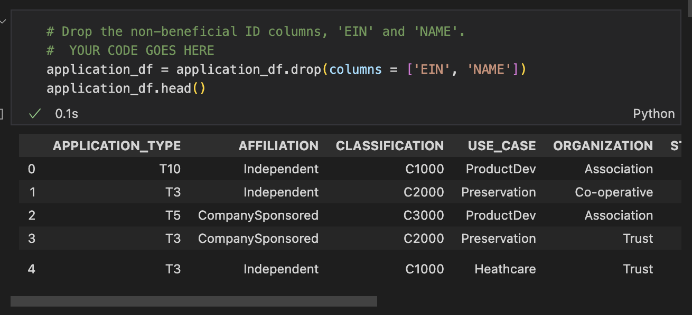

  ## Compiling, Training, and Evaluating the Model
  * How many neurons, layers, and activation functions did you select for your neural network model, and why?

    *The first optimisation testing contained two `hidden layers`, with 20 and 12 `neurons` in each layer respectively, and a `relu` function in each case to start small.*
    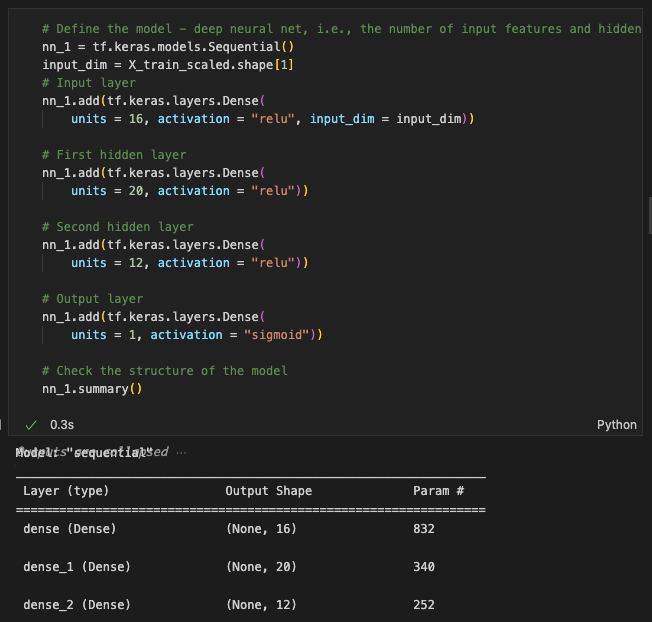
  
  * Were you able to achieve the target model performance?
  
    *I was not able to achieve the target of `75%`. The closest accuracy resulted at `72.91%`(4sf)*
    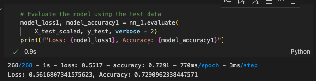

  * What steps did you take in your attempts to increase model performance?

    *In attempt to increase model performance, I trialed two more models with increased the `neurons` and `hidden layers`. Test 2's accuracy scored `72.79%`(4sf), whilst Test 3's accuracy scored `72.69%`(4sf)*

    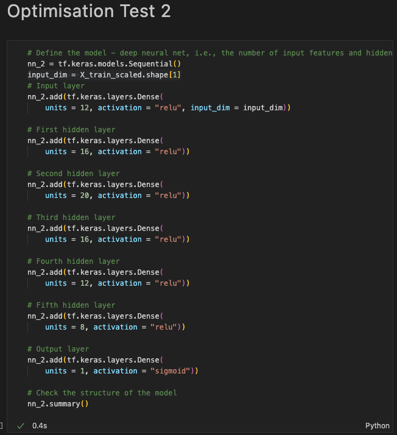
    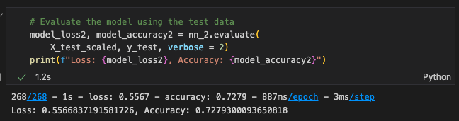
    
    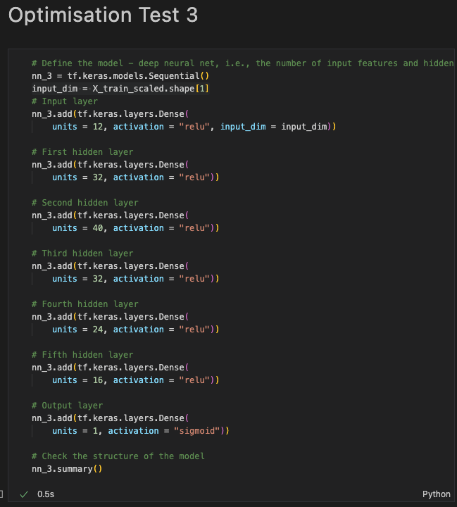
    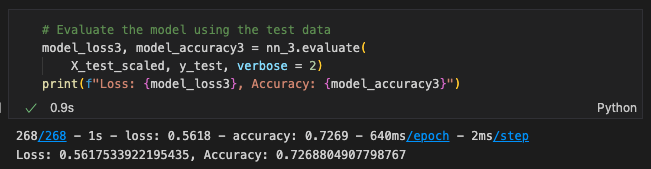

3. **Summary**: Summarize the overall results of the deep learning model. Include a recommendation for how a different model could solve this classification problem, and then explain your recommendation.

    *To conclude my investigations, I decided to run an auto-optimisation model using `keras-tuner`. This took a while longer to run, and found that the best accuracy the model could reach was `73.36%` (4sf), with the following `hyperparameters`*

    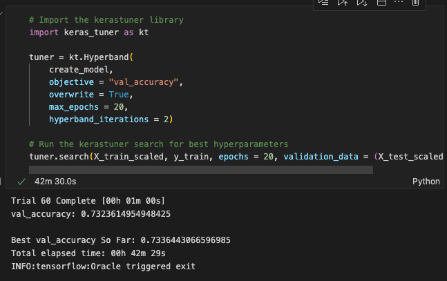   
    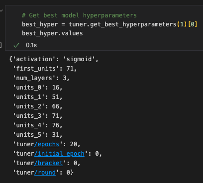

- - -

## Rubric

[Unit 21 Homework Rubric](https://docs.google.com/document/d/1SLOROX0lqZwa1ms-iRbHMQr1QSsMT2k0boO9YpFBnHA/edit?usp=sharing)

- - - 

© 2022 Trilogy Education Services, a 2U, Inc. brand. All Rights Reserved.	

